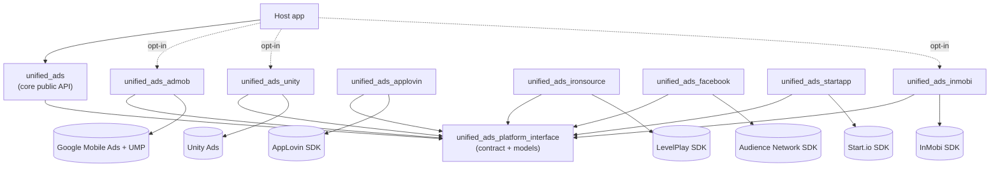
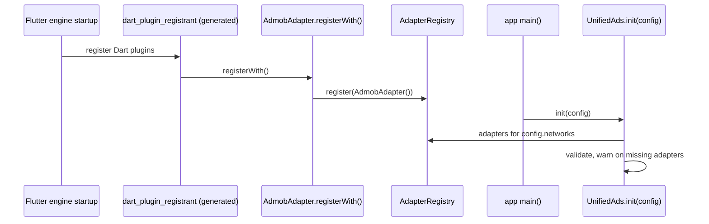
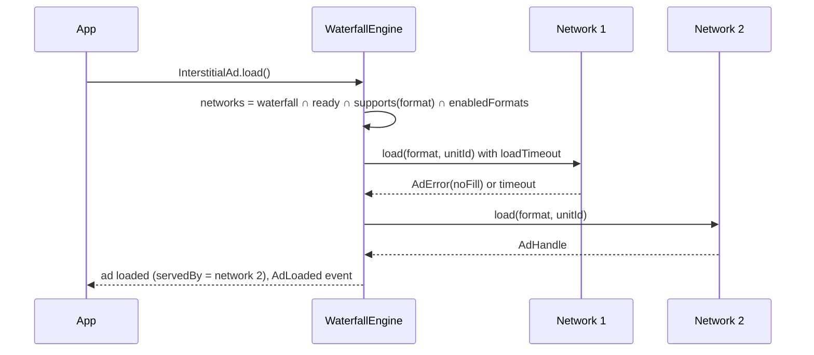
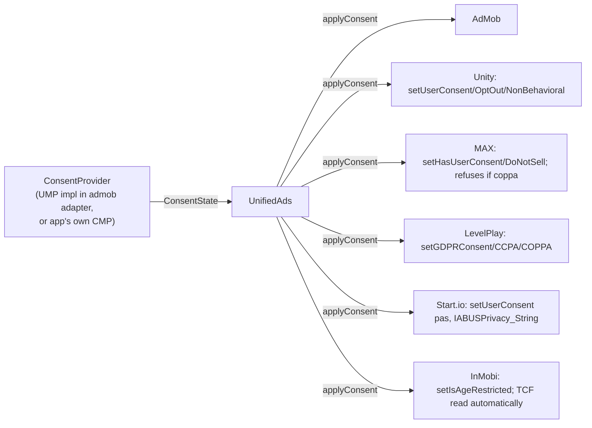

# unified_ads: Architecture

This document describes how `unified_ads` is structured, how adapters plug in, and, most importantly, how an app
links **only** the ad SDKs it opts into. SDK versions and per-network facts live in [`SDK_STATUS.md`](SDK_STATUS.md).
The delivery roadmap is in [`IMPLEMENTATION.md`](IMPLEMENTATION.md).

> Status: design approved for Phase 2+ (2026-10-07). Signatures here are the **contract**. Exact Dart names may be
> refined in Phase 2, and any change is reflected back here.

---

## 1. Goals and non-goals

**Goals**
1. One idiomatic Dart API for Banner, Interstitial and Rewarded ads across 7 networks.
2. **Opt-in linking:** an app that uses AdMob + Unity + InMobi ships exactly those three native SDKs.
3. The host app never crashes because of an ad. Every failure surfaces as an `AdError`.
4. Waterfall fallback, preloading, frequency capping, consent and ATT behind the same API.

**Non-goals**
- Server-side bidding or acting as a mediation platform. We only order networks client-side.
- Native (custom-layout) ads in v1.
- Desktop and web.

---

## 2. Package structure



### 2.1 Dependency rules (enforced in review and in CI)
| Package | May depend on | Must never depend on |
|---|---|---|
| `unified_ads_platform_interface` | `flutter`, `plugin_platform_interface`, `meta` | core, any adapter, any ad SDK |
| `unified_ads` (core) | platform interface | **any adapter**, any ad SDK (Gradle/Pod/SPM) |
| `unified_ads_<network>` | platform interface, **its own** native SDK | core, other adapters, other SDKs |
| `example` | core + the adapters it demos | — |

Because core knows only the abstract `AdNetworkAdapter`, adding or removing an adapter never touches core.

### 2.2 What lives where
| Package | Contents |
|---|---|
| platform interface | `AdNetwork`, `AdFormat`, `AdConfig`, `NetworkConfig`, `BannerSize`, `AdError`/`AdErrorCode`, `RewardItem`, sealed `AdEvent`, `AdNetworkAdapter`, `AdapterRegistry`, `ConsentProvider`/`ConsentState`, `TrackingAuthorization`, `AdsLogger`, `TestModeSupport` |
| core | `UnifiedAds` facade, `InterstitialAd`, `RewardedAd`, `BannerAd`, `UnifiedBannerWidget`, `WaterfallEngine`, `AdCache`, `FrequencyCap`, `AdConfigLoader` (JSON), error mapping, the iOS ATT helper (native) |
| adapter | the Dart `AdNetworkAdapter` subclass, the Pigeon schema + generated code, Kotlin + Swift implementation, banner PlatformView factory, `consumer-rules.pro`, podspec / `Package.swift` declaring **only** its SDK, setup doc |

---

## 3. Adapter registration

Each adapter is a Flutter plugin that declares **both** a native `pluginClass` and a `dartPluginClass`:

```yaml
# packages/unified_ads_admob/pubspec.yaml (shape, Phase 3)
flutter:
  plugin:
    platforms:
      android:
        package: dev.arovyx.plugin.unifiedads.admob
        pluginClass: UnifiedAdsAdmobPlugin
        dartPluginClass: AdmobAdapter
      ios:
        pluginClass: UnifiedAdsAdmobPlugin
        dartPluginClass: AdmobAdapter
```



**Why not federated `implements: unified_ads`?** Flutter selects **one** implementation of a federated plugin per
platform, and we need N adapters active at once. Adapters therefore `extend` the `AdNetworkAdapter` Dart class
from the platform interface, which gives the same type-safety as `implements`/`extends` that CLAUDE.md asks for,
without the federated-plugin `implements:` key.

**Escape hatch:** `UnifiedAds.init(config, adapters: [AdmobAdapter()])` registers adapters explicitly. It is used by
unit tests (fake adapters) and wherever the generated registrant doesn't run (e.g. background isolates).

> ⚠ To verify in Phase 3: automatic `dartPluginClass` registration for a plugin that has no `implements:`
> key. If it doesn't work, explicit registration becomes the documented primary path. Only the adapter's
> README line changes; the API stays the same.

---

## 4. Opt-in linking: how excluded SDKs never reach the binary

The rule is simple: **a native SDK is declared only in its own adapter's native build file.** If the app doesn't
depend on that adapter, the build never sees the file.

### 4.1 Android (Gradle)
1. `flutter pub get` writes `.flutter-plugins-dependencies`, listing **only** plugins in the app's resolved
   dependency graph.
2. The Flutter Gradle plugin (`dev.flutter.flutter-plugin-loader` in `settings.gradle.kts`) `include`s one Gradle
   subproject per listed plugin and adds `implementation(project(":<plugin>"))` to the app.
3. `packages/unified_ads_admob/android/build.gradle.kts` is the **only** place with
   `implementation("com.google.android.gms:play-services-ads:25.5.0")`.
4. Core's `android/build.gradle.kts` has **no** ad-SDK dependency.

Result: without `unified_ads_unity`, there is no `:unified_ads_unity` project, no `com.unity3d.ads` Maven resolution,
no classes in the dex, and no merged manifest entries. Each adapter also ships `consumer-rules.pro`
(`consumerProguardFiles`), so R8 rules travel with the SDK and disappear with it.

**Verification (CI job "opt-in check"):** build the example with a subset, then
`./gradlew :app:dependencies --configuration releaseRuntimeClasspath` must not contain any excluded group
(`com.unity3d.ads`, `com.applovin`, …), and `apkanalyzer dex packages app-release.apk` must not list excluded packages.

### 4.2 iOS (CocoaPods)
1. The app `Podfile` calls `flutter_install_all_ios_pods`, which reads `.flutter-plugins-dependencies` and adds a
   `pod '<plugin>', :path => …` **only** for listed plugins.
2. `packages/unified_ads_admob/ios/unified_ads_admob.podspec` is the **only** podspec with
   `s.dependency 'Google-Mobile-Ads-SDK', '13.11.0'`.
3. Core's podspec depends only on `Flutter`.

Result: an excluded adapter means no pod, no download, no linker input, no `-framework` flags, and therefore no linker
warnings. **Verification:** `Podfile.lock` must contain only the opted-in SDK pods.

### 4.3 iOS (Swift Package Manager)
When the app enables Flutter's SwiftPM integration, each plugin's `ios/<plugin>/Package.swift` is added as a local
package, and the SDK is a `.package(url:…)` dependency in **that adapter's** manifest only. The same exclusion
guarantee holds.
Vendors without SPM (Start.io, InMobi; Unity ⚠) ship **CocoaPods-only** adapters, and Flutter's mixed mode builds
them through CocoaPods while the rest use SPM.

### 4.4 Static vs dynamic frameworks
- Adapters are compatible with both `use_frameworks!` and `use_frameworks! :linkage => :static`. CI builds both
  variants.
- InMobi ships a dynamic xcframework, while most others ship static or vendored xcframeworks (see SDK_STATUS §2).
  CocoaPods embeds dynamic vendored frameworks automatically.
- Any adapter needing `-ObjC` sets it in its own podspec `pod_target_xcconfig`/`user_target_xcconfig`, never
  in core.

### 4.5 Alternative: single-package mode
For teams that prefer one dependency, see [`docs/single_package_mode.md`](docs/single_package_mode.md). It is driven
by `--dart-define=ADS_NETWORKS=…` + a Gradle property + a Podfile ENV variable. It is documented with trade-offs,
and the federated mode above is the recommended default.

---

## 5. The `AdNetworkAdapter` contract

```dart
/// Implemented (extended) by every network adapter package.
abstract class AdNetworkAdapter {
  AdNetwork get network;
  Set<AdFormat> get supportedFormats;      // empty for documented stubs
  TestModeSupport get testModeSupport;     // flag | testDevices | testSuiteOnly | none
  bool get requiresAdUnitId => true;       // false for app-ID-only networks (Start.io)

  /// Idempotent. Completes (never throws); failure is returned as AdError.
  Future<AdResult<void>> initialize(NetworkConfig config, {required bool testMode});

  /// Full-screen formats (interstitial, rewarded, …).
  Future<AdResult<AdHandle>> load(AdFormat format, String adUnitId);
  Future<AdResult<void>> show(AdHandle handle);
  bool isReady(AdHandle handle);
  Future<void> destroy(AdHandle handle);

  /// Banner: core builds the PlatformView; the adapter names the view type and creation params.
  String get bannerViewType;               // 'dev.arovyx.plugin.unifiedads/<network>/banner'
  Map<String, Object?> bannerCreationParams(BannerRequest request);

  Future<void> applyConsent(ConsentState state);
  Stream<AdEvent> get events;              // broadcast; every event carries network + adId; listenable after dispose
  Future<void> dispose();                  // releases everything; safe to call twice; initialize may follow
}
```
Adapters that bridge to native code extend **`BridgedAdNetworkAdapter`** (platform interface, Phase 4). It implements this
contract once (never throwing, error mapping, loaded-ad tracking, event translation), so each adapter only bridges six
native calls. All seven native adapters use it (AdMob was refactored onto it); `UnsupportedAdNetworkAdapter` remains for documented stubs.

The implemented contract (with full dartdoc) is
`packages/unified_ads_platform_interface/lib/src/ad_network_adapter.dart`. `UnsupportedAdNetworkAdapter` is the
base for documented stubs, and `FakeAdNetworkAdapter` (`package:unified_ads/testing.dart`) is a scriptable fake for
tests.

**Semantics**
| Concern | Contract |
|---|---|
| Errors | Adapters **never throw** across the boundary. Native exceptions and SDK error codes map to `AdError(code, message, network, nativeCode)`. Core also wraps every adapter call in a guard, so a buggy adapter cannot crash the app (§9). |
| Unsupported | A format not in `supportedFormats` returns `AdErrorCode.unsupportedFormat` without touching native code. A stub network returns `unsupportedNetwork`. |
| Events | A sealed `AdEvent`: `AdLoaded`, `AdFailedToLoad`, `AdFailedToShow`, `AdShown`, `AdImpression`, `AdClicked`, `AdClosed`, `AdEarnedReward(RewardItem)`, `BannerSized(width, height)`. Each event has `network`, `adId`, `format` and `timestamp`. |
| Ordering | For one handle: `loaded` comes before `shown`/`impression`, then `clicked`*, then `earnedReward`?, then `closed`. Native SDKs differ, so adapters normalise this (e.g. buffer reward until close if the SDK fires it after close). |
| Idempotence | `initialize` and `dispose` are safe to repeat, and `initialize` may follow `dispose` (every `UnifiedAds.init` disposes the previous session's adapters). Calling `show` on a consumed handle returns `notReady`. |
| Show completion | `show` completes when the ad is presented (or failed to present), not when it closes; closing is signalled by `AdClosed`. |
| Threading | All native SDK and UI calls run on the platform main thread. Pigeon FlutterApi callbacks are posted on the main thread, which is what Flutter requires for channel messages. |

### 5.1 Native bridge (Pigeon)
Each adapter owns `pigeons/messages.dart`, which generates Dart, Kotlin and Swift code.
- `@HostApi() <Network>HostApi`: `initialize`, `load`, `show`, `isReady`, `destroy`, `applyConsent`, `dispose`.
- `@FlutterApi() <Network>EventsApi`: `onAdEvent(AdEventMessage)`, which carries the event kind, adId, error fields and reward.
- Pigeon names its channels `dev.flutter.pigeon.unified_ads_<network>.<Api>.<method>` from `dartPackageName`, so adapters
  never collide. Platform-view types and the core ATT channel use the `dev.arovyx.plugin.unifiedads/…` prefix.
- **Pigeon 29** generates `suspend` host methods for Kotlin (the adapter adds `kotlinx-coroutines-android`) and `async throws`
  methods for Swift, which are invoked from a `@MainActor` task. Each Swift implementation delegates to a `@MainActor` method,
  so SDK calls stay on the main thread. Native → Dart events go through an ordered main-thread queue.
- Only the Pigeon output is generated. The adapter's Dart class translates messages to and from platform-interface models.

---

## 6. Configuration

```dart
AdConfig(
  testMode: true,                                   // global; NetworkConfig.testMode overrides
  waterfall: [AdNetwork.admob, AdNetwork.unity, AdNetwork.inmobi],
  networks: {
    AdNetwork.admob: NetworkConfig(
      appId: 'ca-app-pub-xxxxxxxxxxxxxxxx~yyyyyyyyyy',  // must ALSO be in manifest/Info.plist (see below)
      bannerAdUnitId: '…', interstitialAdUnitId: '…', rewardedAdUnitId: '…',
      enabled: true, enabledFormats: {AdFormat.banner, AdFormat.interstitial, AdFormat.rewarded},
    ),
  },
  loadTimeout: Duration(seconds: 10),               // per waterfall attempt
  preload: PreloadPolicy(formats: {AdFormat.interstitial, AdFormat.rewarded}, onInit: false),
  frequencyCaps: {AdFormat.interstitial: FrequencyCap(maxShows: 3, per: Duration(hours: 1))},
)
```

- **Network-specific credentials** (Unity Game ID, MAX SDK key, LevelPlay App Key, InMobi Account ID + numeric
  placements, Start.io App ID) map onto `NetworkConfig.appId` plus typed `extras`. Validation per network is documented
  in each setup doc. For example, InMobi placement IDs must parse as a 64-bit integer. Start.io per-format IDs are optional.
- **Build-time-only IDs:** the AdMob App ID must be in `AndroidManifest.xml` / `Info.plist` (the SDK crashes at launch
  otherwise). Core validates that the runtime config matches when the adapter can read the manifest value, and the setup
  docs show the exact entries.
- **Declarative config:** `AdConfigLoader.fromAsset('assets/ads_config.json')` loads JSON with the same shape, validates it
  (unknown keys → `AdError(invalidConfig)` with a JSON path), and merges it with programmatic overrides. No `build_runner`
  is needed, and it works with hot restart. An optional CLI (`dart run unified_ads:generate`) turns a `unified_ads:`
  section in `pubspec.yaml` into that asset.
- **Per-platform IDs:** in Dart use `PlatformValue.select(android: …, ios: …)` for any ID; in JSON any ID may be a
  string or `{"android": …, "ios": …}`. Unity Game IDs and most unit IDs differ per platform.

---

## 7. Runtime flows

### 7.1 Initialization
```mermaid
sequenceDiagram
    participant App
    participant UA as UnifiedAds
    participant AR as AdapterRegistry
    participant A as Adapter (each, in parallel)
    App->>UA: init(config)
    UA->>UA: dispose previous session (hot restart safe)
    UA->>UA: validate config → AdError(invalidConfig) on failure
    UA->>AR: resolve adapters for enabled networks
    UA->>UA: guards: missing adapter → warn & skip; unity+ironsource → configConflict, skip unity; MAX + coppa → skip
    par per network, with initTimeout
        UA->>A: applyConsent(currentConsent)
        UA->>A: initialize(networkConfig, testMode)
    end
    A-->>UA: AdResult (ok | AdError)
    UA-->>App: InitResult {ready: [...], failed: {network: AdError}}
```
Failed networks stay registered but are skipped by the waterfall until the next `init`.
`UnifiedAds.isInitialized` becomes true once at least one network is ready.

### 7.2 Waterfall load

If every network fails, the caller gets `AdError(noFill)` with an `attempts` list (one `AdError` per network), so
developers can see why each one failed. `forceNetwork:` bypasses the ordering (used by the example's banner selector).

### 7.3 Cache and preload
- One slot per full-screen format. For every format in `PreloadPolicy.formats` (default: interstitial + rewarded), core
  reloads through the waterfall after `closed` or `failedToShow` ("preload next"). `PreloadPolicy.onInit` also preloads
  right after init, and `UnifiedAds.preload(format)` preloads on demand. The next `load()` takes the cached ad.
- Each cached ad expires after `AdConfig.cacheTtl` (default 1 h; AdMob ads expire after about 1 h). An expired ad is
  destroyed and reloaded transparently.
- `UnifiedAds.hasCachedAd(format)` reflects the cache slot, so the app can check it cheaply before a natural break.

### 7.4 Frequency capping
`FrequencyCap(maxShows, per)` is kept per format as a sliding window of show timestamps, in memory by default. A
`FrequencyStore` interface allows persistence (the example uses shared_preferences). `show()` returns
`AdError(frequencyCapped)` without touching native code.

---

## 8. Banner (PlatformView)

| Aspect | Design |
|---|---|
| View type | `dev.arovyx.plugin.unifiedads/<network>/banner`, registered by each adapter's native plugin |
| Android | `PlatformViewLink` + `PlatformViewsService.initExpensiveAndroidView` (**Hybrid Composition**). Ads are WebView-based and HC gives correct touch, accessibility and click-through behaviour. TLHC is benchmarked in Phase 3 and may become an opt-in setting. |
| iOS | `UiKitView`, with the native `UIView` hosting the SDK banner. `rootViewController` is resolved at load time for click-through presentation. |
| Sizing | `BannerSize.standard` (320×50), `.largeBanner`, `.mediumRectangle`, `.adaptiveAnchored(width)`, `.adaptiveInline(width, maxHeight)`. Dart passes the available width, native resolves the actual size and emits `BannerSized`, and the widget animates to that height. Networks without adaptive support fall back to 320×50, with a debug log. |
| Gestures | `gestureRecognizers` is empty, so taps go to the native view. Scrolling in a parent list still works because the banner doesn't claim drag gestures. |
| Safe area | Anchored banners are wrapped in `SafeArea` on the Dart side. Inline banners are laid out by the parent. |
| Waterfall | `UnifiedBannerWidget` asks the waterfall for a network before building the view. If a network fails, the view is disposed and the next network is tried. `servedBy` is exposed through a callback and on `BannerAd`. |
| Lifecycle | Native views are destroyed in `dispose` (PlatformView `dispose` → SDK `destroy()`). Refresh is controlled by the network dashboard. |

---

## 9. Error model

`AdError { AdErrorCode code; String message; AdNetwork? network; String? nativeCode; List<AdError> attempts; }`

| `AdErrorCode` | Raised when |
|---|---|
| `notInitialized` | an API is used before `UnifiedAds.init` |
| `invalidConfig` | config or JSON validation fails (the message includes the field path) |
| `configConflict` | Unity + LevelPlay are both enabled; MAX is used with COPPA |
| `adapterMissing` | the config enables a network whose adapter package isn't installed |
| `initializationFailed` | the native SDK init failed or timed out |
| `unsupportedFormat` | the network doesn't support the format (including stretch formats) |
| `unsupportedNetwork` | a documented stub adapter (`UnsupportedAdNetworkAdapter`); none of the seven networks currently |
| `formatDisabled` / `networkDisabled` | disabled by config |
| `noFill` | no ad available (the waterfall aggregates `attempts`) |
| `timeout` | load exceeded `loadTimeout` |
| `networkError` | connectivity or server errors reported by the SDK |
| `notReady` | show was called with no loaded or valid ad |
| `alreadyShowing` | show was called while another full-screen ad is visible |
| `frequencyCapped` | the frequency cap was hit |
| `showFailed` | the SDK reported a show failure |
| `noActivity` | no foreground Activity or ViewController is available |
| `internal` | anything unexpected (the original exception is kept in `message`, and the full stack trace is logged) |

**Never-crash guarantees:**
- Kotlin and Swift wrap every host-API body in `try/catch` and map the exception to an error.
- Pigeon errors become `PlatformException`, which the adapter maps to `AdError`.
- Core wraps every adapter call in a `_guard` that catches remaining `Object`s and reports `internal`.
- Callbacks into user code are invoked inside `runZonedGuarded`-style protection, so a throwing listener is logged
  and does not break the ad pipeline.

---

## 10. Lifecycle and threading

| Concern | Android | iOS |
|---|---|---|
| Plugin lifecycle | `FlutterPlugin` + `ActivityAware`; holds a weak reference to the current Activity; `onDetachedFromActivityForConfigChanges` keeps loaded ads alive and re-binds on reattach | `FlutterPlugin`; the current `UIViewController` is looked up from the key window scene at show time |
| Pause/resume | forwarded to SDKs that need it (e.g. some banner views) via `ProcessLifecycleOwner` | `UIApplication` notifications |
| Rotation | full-screen ads are handled by the SDK; banners re-resolve their adaptive size on a width change | same |
| Engine detach / hot restart | `onDetachedFromEngine` destroys every handle and view | `detachFromEngine` destroys every handle and view |
| Dart hot restart | `UnifiedAds.init` first calls `dispose()` on the previous session. The adapter's native `dispose` clears per-engine state, while SDK-global init is kept (SDKs can't de-init) | same |
| Threading | `Handler(Looper.getMainLooper())` for SDK and UI calls; Pigeon replies on the main thread | `DispatchQueue.main` |

---

## 11. Consent and ATT



- `ConsentState { bool? gdprApplies; bool? consentGiven; String? tcString; String? gppString; bool? ccpaOptOut; bool coppa; }`.
- `ConsentProvider { Future<ConsentState> gather({bool forceForm}); Future<void> showPrivacyOptions(); Future<bool> canRequestAds(); }`.
  `AdmobConsentProvider` (in `unified_ads_admob`) wraps Google UMP. Apps that use another CMP implement the interface
  themselves, so core never depends on UMP.
- IAB TCF and GPP strings written by any CMP are read automatically by AdMob, InMobi, MAX and LevelPlay. Explicit
  setters cover Unity and Start.io.
- **ATT:** `UnifiedAds.requestTrackingAuthorization()` returns a `TrackingStatus`. It lives in core's iOS code (it
  needs no ad SDK), returns `notApplicable` on Android, and requires `NSUserTrackingUsageDescription`. The recommended order
  is ATT → consent → `init`.

---

## 12. Logging

`AdsLogger` with levels `verbose < debug < info < warning < error < none`. It is **silent by default**
(`AdsLogger.silent`). Apps plug in a sink: `UnifiedAds.logger = AdsLogger.console(level: AdsLevel.debug)` or a
custom `AdsLogSink` (e.g. forward to Crashlytics). Native adapters forward their logs through the events channel when
`debug` is on. Ad unit IDs are partially masked in logs.

---

## 13. Testing strategy

| Layer | Approach |
|---|---|
| Platform interface + core | Pure Dart unit tests with `FakeAdapter` (scriptable: succeed, fail, timeout, delayed events). Covers waterfall order and fallback, cache expiry, frequency cap, config validation, error mapping, hot-restart dispose. |
| Banner widget | Widget tests using a fake view type and `PlatformViewsService` mocks: size negotiation, fallback, dispose. |
| Adapters (Dart) | Unit tests with mocked Pigeon host APIs. |
| Adapters (native) | Kotlin JUnit for error-mapping helpers, and XCTest for the Swift equivalents. |
| Integration | `example/integration_test`: init → load → show with network test IDs on an emulator or simulator. |
| Opt-in | A CI job builds the example with a subset and asserts the excluded SDKs are absent (§4.1, §4.2). |
